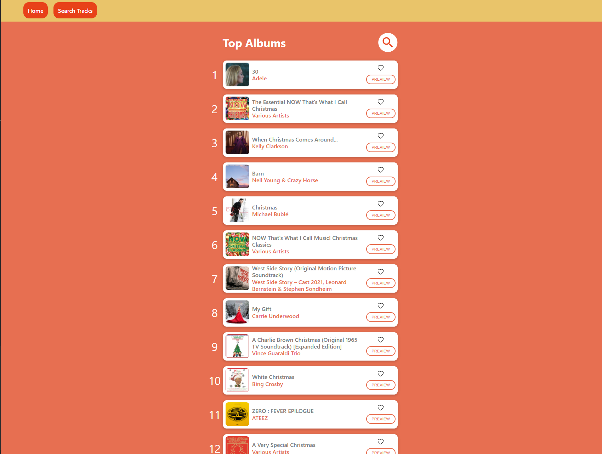
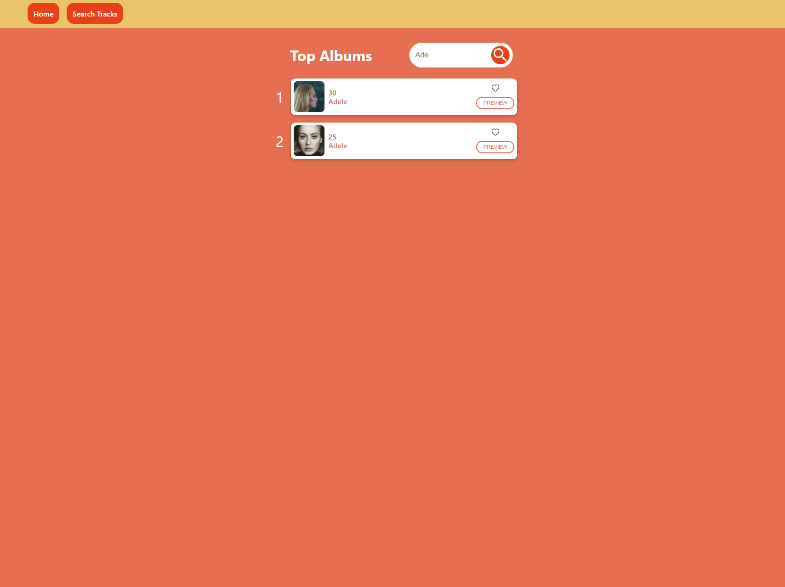
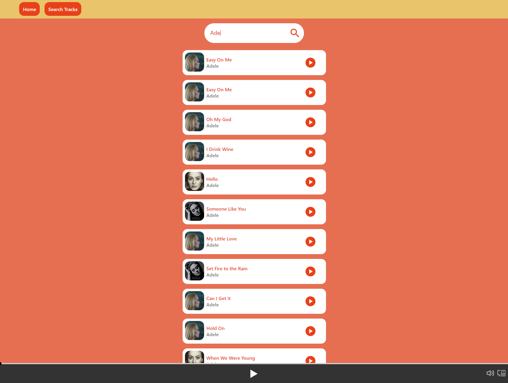

# Music API

## Table of Contents

- [General info](#general-info)
- [Technologies](#technologies)
- [Setup](#setup)
- [Results](#results)
- [Improvements](#improvements)

## General info

A website that displays top albums, which can be liked and previewed. Additionally, a search feature has been introduced to search for songs and albums. The app uses React and Node.

## Technologies

Project is created with:

- Node version: v14.15.5
- React version: v17.0.2
- Visual Studio Code version: 1.62
- Windows OS: Windows_NT x64 19043.1237

## Setup

### Installing Node

To run this project, download and install Node from Node.js website (https://nodejs.org/en/)

### Quick Start

To install dependencies, run the following in the terminal:

```
npm install
```

To start the server (backend). Run the following:

```
cd backend/
node server.js
```

To start React (frontend) on http://localhost:3000/. Run the following:

```
cd frontend/
yarn start
```

## Results

Albums are displayed in cards.



A search function allows to sort through artists, albums or year.



A search function allows to search for songs and albums.



## Improvements

- To take this website further, I recommend implementing a full authentication feature between links. Currently, when browsing between 'search tracks' and 'home' for the second time, the authentication token is not passed.
